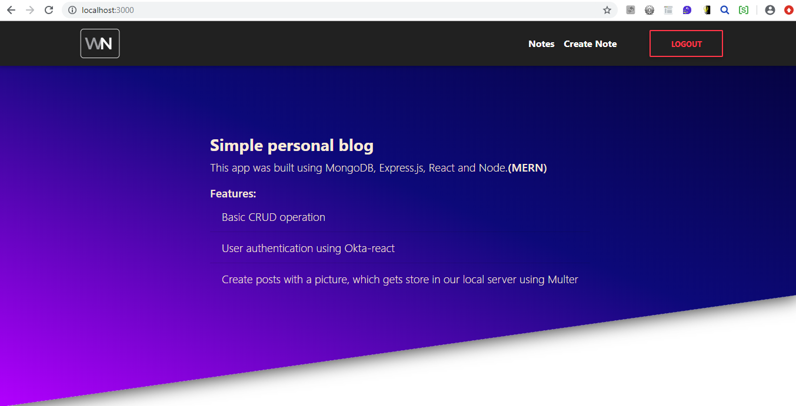
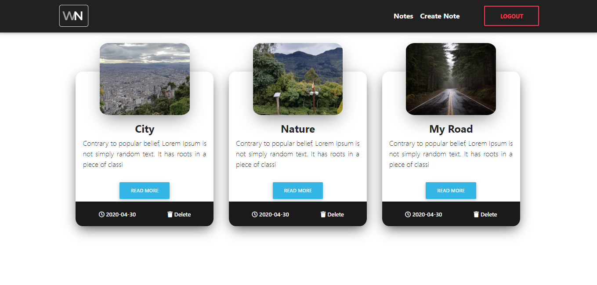
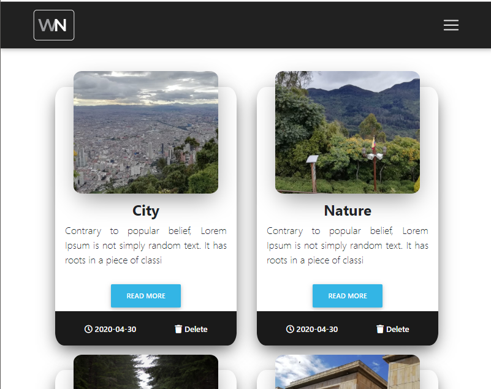
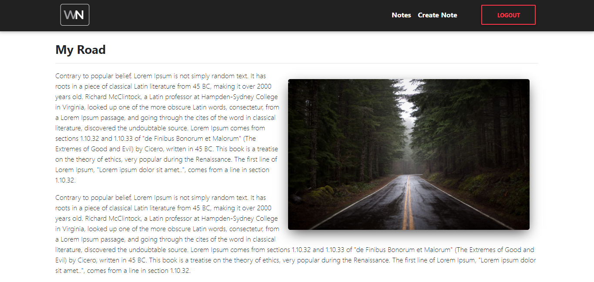

# Workday Notes 
Simple personal blog.

This app was built using MongoDB, Express.js, React and Node (MERN).

## Features
* Crud operations.
* User authentication using OKTA.
* Create post with a pictute, which gets store locally in our server.

## Screenshots

### Home

### Create Post

### Post List - different screen size

### Post

